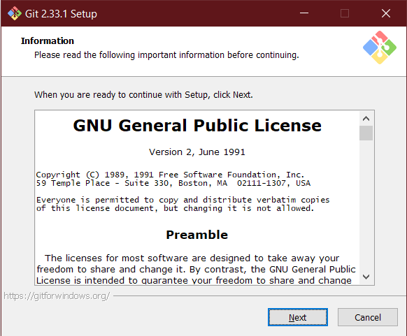
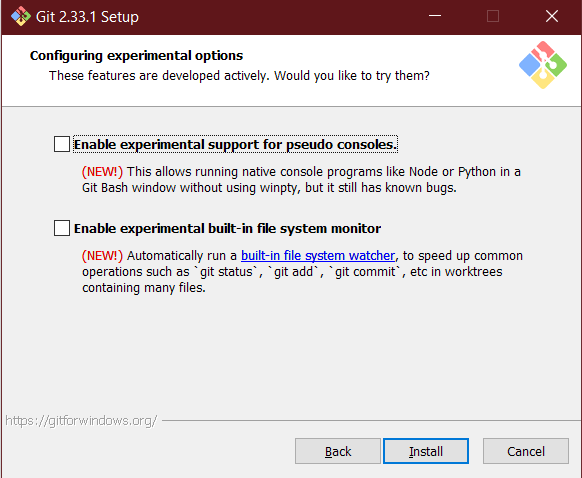
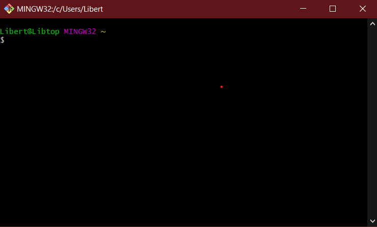
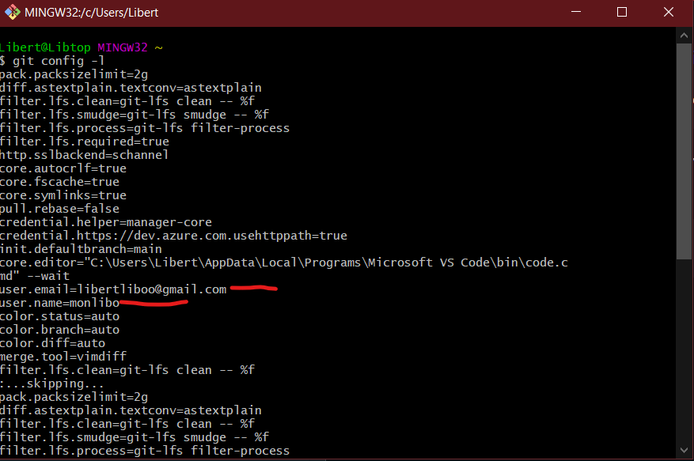

Ce pdf a été produit et généré par [Libert Assogba](https://github.com/monlibo) 🤗🤩

# Installation et configuration de Git

<br/>

## 1. 🤓 Téléchargement de Git

- Rendez vous sur cette page https://github.com/git-for-windows/git/releases/download/v2.38.1.windows.1/Git-2.38.1-32-bit.exe
- Le téléchargement devrait commencer et terminer bientôt.

## 2. 😎 Installation de Git

Une fois le téléchargement de `Git` terminé, rendez vous dans le dossier où vous l'avez téléchargé.

- Ensuite lancez l'installateur. L'écran devrait ressembler à ça 🚀 :

  <p>
    
  </p>

- Suivez les étapes en appuyant sur `Next` et en laissant les options par défaut. Faites ceci jusqu'à la dernière étape 🛸🪐 :

  <p>
    
  </p>


- Cliquez ensuite sur `Install` pour commencer l'installation 🪐.

## 3. 👨‍💻 Configuration de Git

Lancez `Git Bash` depuis la barre de recherche de windows

  <p>
    
  </p>

- <p style="font-size:16px;font-weight:500">Configuration de nos identifiants 👩‍🔧</p>

  Ici nous allons entrer nos identifiants globalement avec le flag `--global`

  - D'abord notre `username` GitHub

  ```git
  git config --global user.name "Votre username sur GitHub"
  ```

  - Ensuite notre `email`, celui associé à notre compte GitHub

  ```git
  git config --global user.email votreemail@gmail.com
  ```

  Vérifiez ensuite que vos identifiants ont bien été pris en compte en utilisant le script suivant :

  ```git
  git config -l
  ```

    <p>
    
  </p>

- <p style="font-size:16px;font-weight:500">Autres configurations pour une meilleure expérérience 🤹‍♀️</p>

  Exécutez ces scripts

  ```git
  git config --global color.diff auto
  ```

  ```git
  git config  --global color.status auto
  ```

  ```git
  git config --global color.branch auto
  ```

  ```git
  git config --global core.editor vscode
  ```

  ```git
  git config --global merge.tool vscode
  ```

`Git` est enfin installé et configuré. Nous sommes donc prêts pour créer notre premier dépôt 🥳🥳.

> N'oubliez pas de télécharger le projet depuis le dépôt distant sur https://github.com/comwebe/project1 (toutes les instructions sont sur la page).

<p style="font-size:20px;color:b">A bientôt 🐱‍🏍</p>
