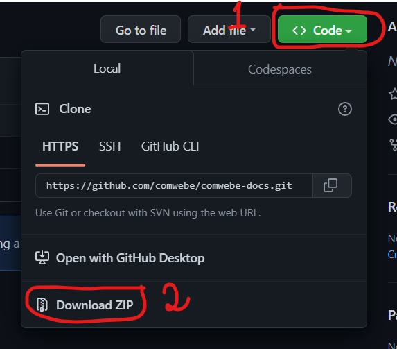
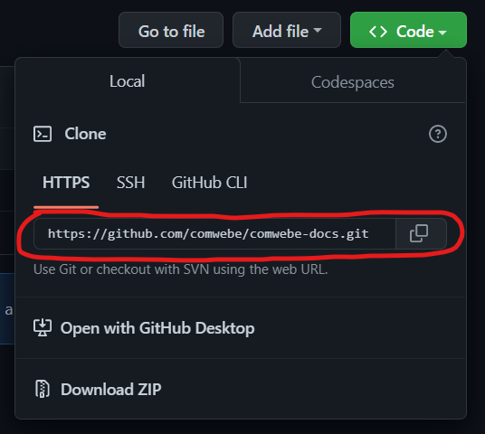
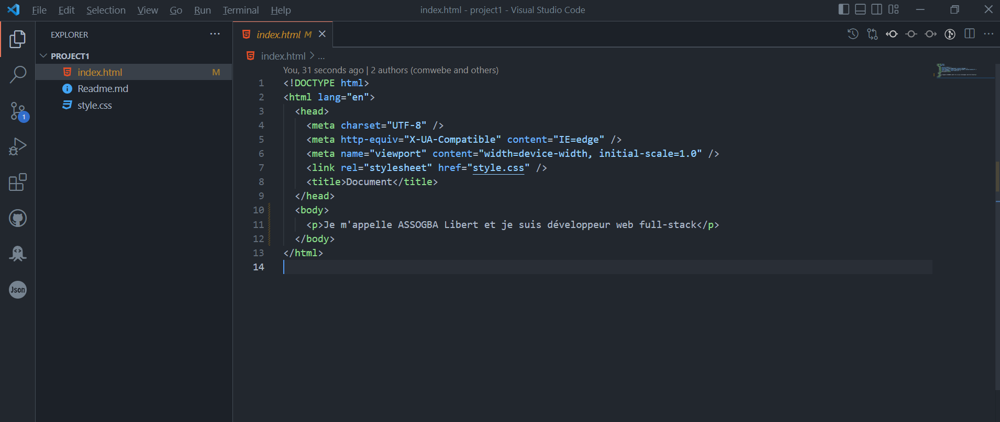
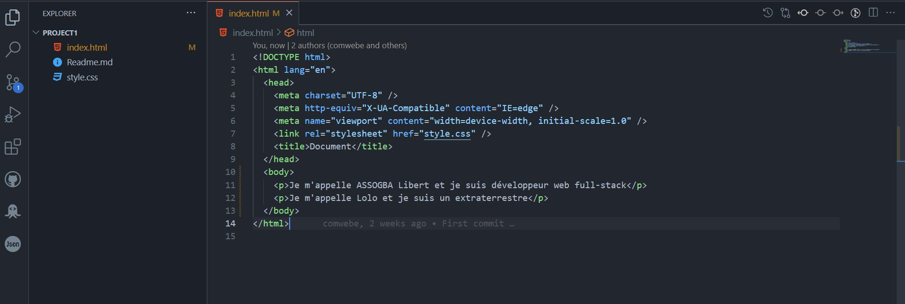

Ce pdf a été produit et généré par [Libert Assogba](https://github.com/monlibo) 🤗🤩

# Chapitre 2 : Faire sa première contribution sur GitHub (1) 👩‍💻 

## 1. Téléchargement du dépôt 📥

Pour pouvoir collaborer sur un projet distant, nous devons d'abord télécharger ce projet en local. La manière la plus courante consiste à le cloner. Mais un autre moyen existe : le téléchargement.

Nous allons apprendre à utiliser ces deux méthodes.

> Nb: A partir de maintenant, nous utiliserons le terme "dépôt" au lieu de "projet"

### Méthode 1 : Télécharger un dépôt 📥

Pour télécharger un dépôt, vous devez vous rendre sur sa page sur GitHub. Nous utiliserons le dépôt [project1](https://github.com/comewebe) de notre compte [Beninese Developers](https://github.com/comewebe).

Une fois sur la page, cliquez sur le boutton vert intitulé `<> Code` puis appuyez sur `Download ZIP` et le téléchargement devrait commencer pour se terminer bientôt.

  <p>
    </p>

### Méthode 2: Cloner un dépôt 🖨

La méthode du clonage est la plus utilisée par les professionnels. Elle est plus rapide et plus simple.

Pour cloner un dépôt :

- Une fois sur le dépôt, cliquez sur le boutton vert intitulé `<> Code`.
- Ensuite copier le lien juste en bas :

    <p>
      </p>


- Une fois le lien copié, lancez votre `terminal ou invite de commande ou git bash` ou tapez tout simplement `cmd` dans la barre de recherche windows.

- Clonons le dépôt :
```git
git clone https://github.com/comwebe/comwebe-docs.git
```
  Ce script va cloner le dépôt sur votre disque dur donc assurez-vous d'être dans le bon dossier ou dans le workspace où vous voulez que le dépôt soit.

## 2. Modifier le dépôt 🖌

A cette étape, si vous avez choisi la première méthode, veuillez dézipper le dossier que vous avez téléchargé, dans votre espace de travail.

Ouvrez ensuite le dossier avec vscode

> NB: Après avoir dézipper le dossier, vous constaterez qu'un dossier avec le même nom se retrouve dans le dossier zippé. 
> 
> Ouvrez le dossier à l'intérieur avec `vscode`

Une fois le dossier ouvert, ouvrez le fichier `index.html` et l'interface dans `vscode` devrait ressembler à ça :

<p>
      </p>

Nous allons maintenant faire nos premières modifications. Pour partir sur de bonnes bases et pour ne pas aller trop vite, nous ne ferons que de petites modifications.

Nous allons chacun ajouter notre nom dans le fichier `index.html`.

### Un peu de HTML ⌨

Le language HTML est le premier language que vous rencontrerez si vous venez de commencer le dévéloppemment web.

C'est un language de <strong>balisage</strong>. Autrement dit, c'est un language qui permet de décrire la <strong>structure d'une page web</strong>.

La structure d'une page web peut être constituée de :

- Paragraphe : représenté par `<p>...</p>`
- Une entête : représentée par `<header>...</header>`
- Une section : || `<section>...</section>`
- Pied de page : || `<footer>...</footer>`
- Naviguation : || `<nav>...</nav>`
- Et bien d'autres...

Ces différents éléments sont chacun des `balises` ou des `contenants` qui décrivent leur `contenu`.

Par exemple :

```html
<p>Je m'appelle Assogba Libert</p>
```
est un paragraphe et 

```html
<footer>Votre bas ou pied de page</footer>
```

est un bas de page.

Modifions maintenant notre `index.html`. Ajoutez un paragraphe qui contient votre nom et ce que vous faîtes : 

<p>
      </p>

Puis enregister votre travail avec `CTRL + s`

Félicitations vous venez de faire votre première modification.

Dans la deuxième partie de ce chapitre, nous allons enregistrer notre `version` du dépôt et protéger nos modifications avec `GIT`.

<p style="font-size:20px;color:b">A bientôt 🐱‍🏍</p>